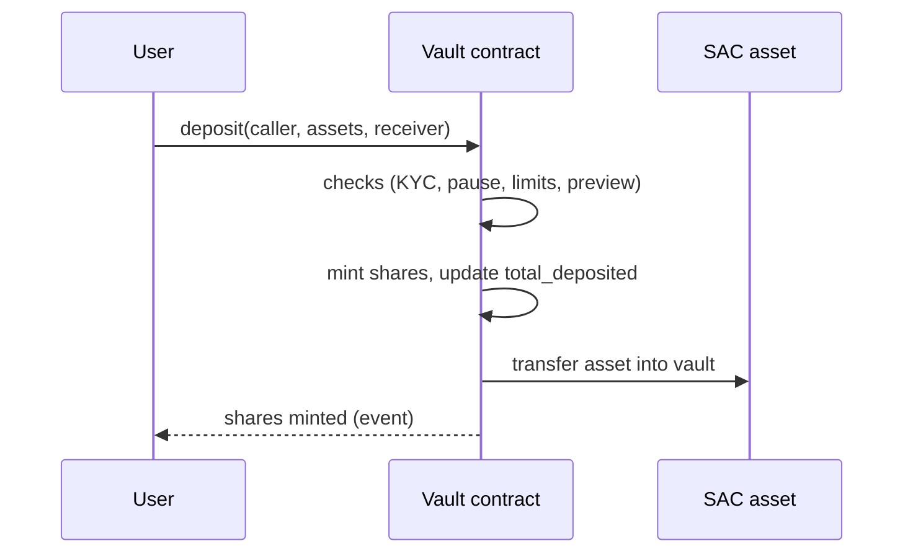
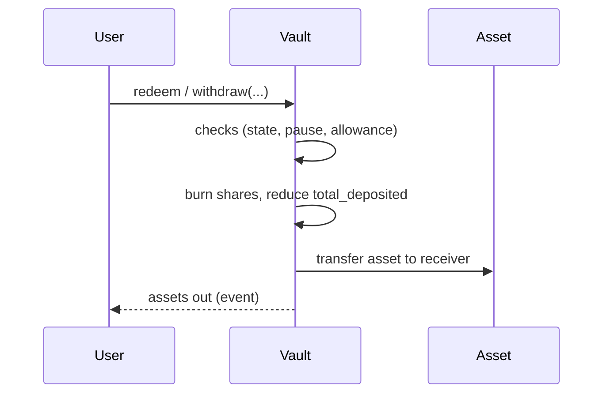
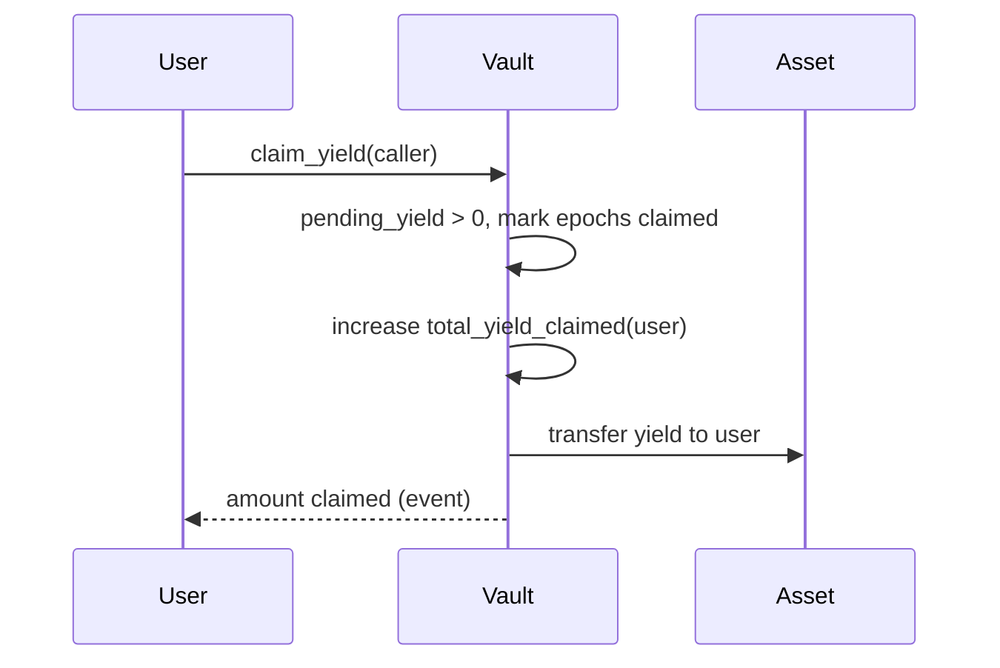

# Threat model

This document complements **`SECURITY.md`** with entry-point analysis, **authorization expectations**, and **data-flow** views for auditors.

**Scope:** `soroban-contracts/contracts/single_rwa_vault`, `soroban-contracts/contracts/vault_factory`.

---

## 1. Entry-point analysis (summary)

### 1.1 `single_rwa_vault`

| Function | Auth (typical) | State / guards (high level) |
|----------|----------------|-----------------------------|
| `__constructor` | Deploy pipeline | Init params validated once. |
| `get_rwa_details`, `rwa_*` | None | Read-only. |
| `is_kyc_verified` | None | External read to verifier (view). |
| `zkme_verifier`, `cooperator` | None | Read-only. |
| `set_zkme_verifier`, `set_cooperator` | Admin | Admin-only. |
| `deposit`, `mint` | Caller signed | KYC, pause, limits, `preview_*` / min deposit. |
| `withdraw`, `redeem` | Caller signed | Active/Matured, pause, allowance if not owner. |
| `preview_*`, `max_*`, `redemption_request` | None | View-style; may simulate. |
| `distribute_yield` | Operator | Active, pause, amount > 0. |
| `claim_yield`, `claim_yield_for_epoch` | User | Active/Matured, pause, blacklist. |
| `pending_yield`, `pending_yield_for_epoch` | None | Pure read. |
| `activate_vault` | Operator | Funding → Active guards. |
| `cancel_funding`, `refund` | Operator / user | Funding cancel path; refund in Cancelled. |
| `mature_vault`, `close_vault` | Operator | Maturity / empty vault. |
| `set_maturity_date`, `set_deposit_limits`, `set_funding_target`, `set_early_redemption_fee` | Admin/operator | Per implementation. |
| `redeem_at_maturity` | User | Matured, yield auto-claim logic. |
| `request_early_redemption`, `cancel_early_redemption` | User | Escrow bookkeeping. |
| `process_early_redemption`, `reject_early_redemption` | Operator | Request processing. |
| `transfer_admin`, `set_operator`, `set_blacklisted`, `pause`, `unpause`, `emergency_withdraw` | Admin (or operator where coded) | See `require_admin` / `require_operator` in source. |
| `approve`, `transfer`, `transfer_from`, `burn`, `burn_from` | SEP-41 | KYC / blacklist / pause as implemented. |

*Exact* `require_*` gates must match the current Rust source — this table is **guidance**, not a substitute for `lib.rs`.

### 1.2 `vault_factory`

| Function | Auth | Notes |
|----------|------|--------|
| `__constructor` | Deploy | Sets admin, defaults, WASM hash. |
| `create_single_rwa_vault`, `create_single_rwa_vault_full`, `batch_create_vaults` | Operator or admin | Deploys vaults. |
| `create_aggregator_vault` | — | Panics `NotSupported`. |
| `remove_vault`, `set_vault_status` | Admin | Registry only. |
| `get_*`, `is_*`, `*_paginated` | None | Reads. |
| `transfer_admin`, `set_operator`, `set_defaults`, `set_vault_wasm_hash` | Admin | Configuration. |

---

## 2. Authorization requirements matrix

Legend: **A** = admin, **O** = operator, **U** = authenticated user (`require_auth`), **P** = public read-only, **X** = not applicable / panic.

| Area | deposit / mint | withdraw / redeem | yield | admin ops | factory deploy |
|------|----------------|-------------------|-------|-----------|----------------|
| **Who must sign** | U (caller) | U (caller) | U | U (admin/operator) | U (operator/admin) |
| **Role check** | KYC, not blacklisted | + state Active/Matured | + state | `require_admin` / `require_operator` | `require_operator_or_admin` |
| **Pause** | Blocked | Blocked | Blocked | Varies | Varies |

---

## 3. Data flow diagrams

### 3.1 Deposit (`deposit` / `mint`)

### 3.2 Withdrawal / redeem (`withdraw` / `redeem`)

### 3.3 Yield claim (`claim_yield`)

---

## 4. Out-of-scope (explicit)

- **Economic** attacks on the RWA asset itself (off-chain default).
- **Governance** of Stellar network or Soroban host.
- **Front-end** phishing and wallet compromise (users must verify contract IDs).

---

## 5. Reviewer sign-off

| Check | Done |
|-------|------|
| Entry points match `lib.rs` on `main` | ☐ |
| Auth matrix updated | ☐ |
| Diagrams reviewed | ☐ |

**Reviewer:** ______________________ **Date:** __________
